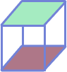
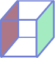
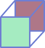
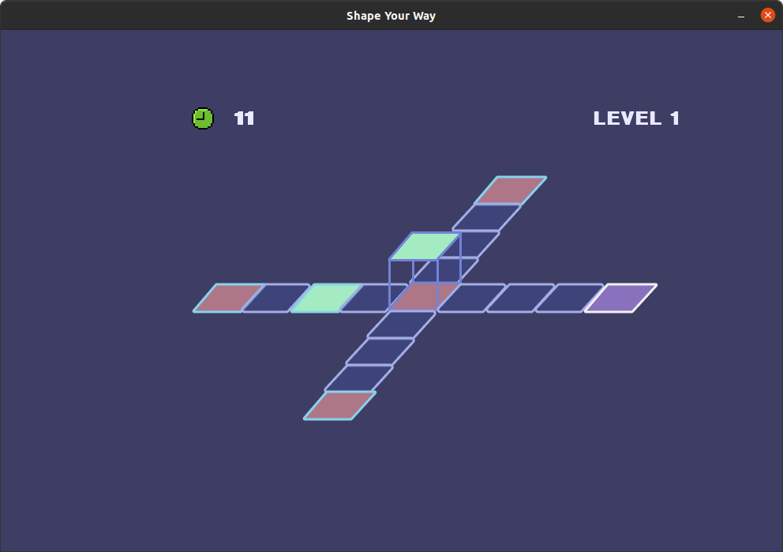
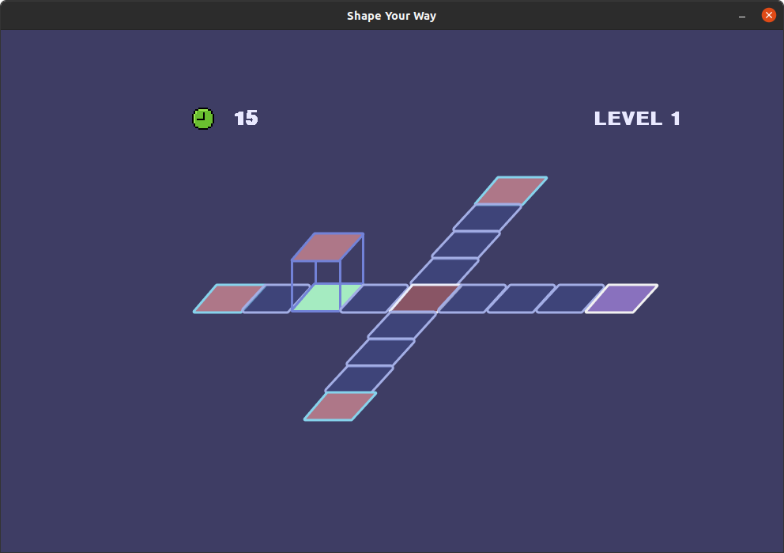
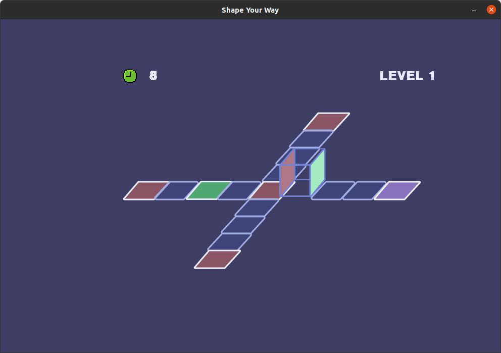

# SHAPE YOUR WAY


[](https://github.com/vittoriasalim/shape-your-way/actions/workflows/python-analysis.yml)


- [SHAPE YOUR WAY](#shape-your-way)
  - [Installation](#installation)
  - [About](#about)


## INSTALLATION

*Python 3.6 or greater is required.*

1. Download the files by pressing the green "Code" button above, followed by "Download ZIP" — extracting all the files once the download is complete.
   - Alternatively, if you have git installed, run `git clone https://github.com/vittoriasalim/shape-your-way` in a terminal to download the repository.
2. Install PyGame with the command `pip3 install pygame` on Linux or `pip install pygame` on Windows.
3. Run `main.py` to start the game.

## ABOUT

It is a puzzle game where player has to complete a specific pattern given with the control of the dice. <br>
The player has the ability to move up, down , left or right, according to the dice.

### ****VISUAL IMAGE :****
- Initially, players will have their dice with "R" facing down (on the floor) and "G" facing up.
- Each player can move RIGHT, LEFT, UP and DOWN with the keyboard buttons (RIGHT, LEFT, UP and DOWN).
- **R** : stands for red tile <br>
- **G** : stands for green tile. <br>


The following is the view of the dice:

        ```
            +---+
            |   |
        +---+---+---+
        |   | R |   |
        +---+---+---+
            |   |
            +---+
            | G |
            +---+
        ```
        

## PLAYER'S MOVEMENT

1. **RIGHT** movement
When the player moves <b>RIGHT</b>, the dice goes from: <br>
 to 

2. **LEFT** movement
When the player moves <b>LEFT</b>, the dice goes from: <br>
 to 

3. **UP** movement
When the player moves <b>UP</b>, the dice goes from: <br>
 to 

4. **DOWN** movement
When the player moves <b>DOWN</b>, the dice goes from: <br>
 to 

<br>

## GOAL OF THE GAME

The player can only win the level if the player:
- passes through all the RED and GREEN colored tile within the time limit
- able to get to the final tile

For example, in level 1: <br>
The map looks like <br>


    - When the player moves LEFT twice, the dice will have the "G" color face down on the GREEN tile.
    - This means that the player has passed the GREEN tiled floor. 


    - When the player moves LEFT again, the tile will change to a deeper GREEN color.
    - This indicates the player has passed the GREEN tiled floor. 


    - Now, the next step is to pass through all the RED and GREEN colored tiles in order to pass the level. 
    - Like the image below. 


    - The next step of the game is to get to the final tile which is colored like: 


<br>

## COLOR CHANGE OF THE TILES

If the player is able to pass the RED tile with the "RED" color of the dice facing the tile, <br>
the RED tile will change color. <br>
 to 

If the player is able to pass the GREEN tile with the "GREEN" color of the dice facing the tile, <br>
the GREEN tile will change color. <br>
 to 

<br>

## ADDITIONAL FEATURES


- **Wizard** : When the player hits a tile with a wizard, the timer will be reduced by 5. <br>
The player will still remain at the same position and the wizard will be gone.<br>
 

- **Reset** : When the player hits this tile, the player's dice position will be reset to the initial starting position. <br>
The dice will remain the same as when the player hits the tile.<br><br>
 
<br>

## DEPENDENCIES
- pygame, version = 2.1.2

<br>

## WHAT'S NEXT

As the player progresses into higher levels, we plan to increase the size of the map. Initially, the size of the map is 10x10. We can also add in new features similar to the additional features, for example, the jump tile in which when player hits the tile, the dice will jump into different locations. There are many features that could be added which we think only our creativity limits us. Moreover, the map's user interface could also be improved by changing the design of the tiles, such as a fiery tile. We could also implement a new game mode where players have a maximum number of moves which increases the game difficulty. We could also implement a shop feature where players can buy different kinds of dice design.
