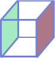
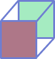
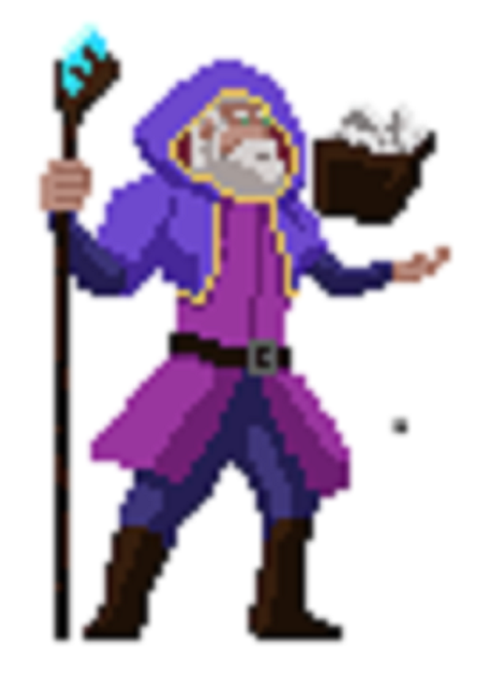

# Shape Your Way

## About

It is a puzzle game where player has to complete the pattern given with the control of the dice. <br>
The player has the ability to move up, down , left or right, according to the dice.

Our current dice looks like this:
```
    +---+
    |   |
+---+---+---+
|   | R |   |
+---+---+---+
    |   |
    +---+
    | G |
    +---+
```
Visually:<br>


"R" stands for red color and "G" stands for green color. <br>
Initially, players will have their dice with "R" facing down (on the floor) and "G" facing up.

Each player can move RIGHT, LEFT, UP and DOWN with the keyboard buttons (RIGHT, LEFT, UP and DOWN).

<br>

## Player's Movement

1. RIGHT movement
When the player moves <b>RIGHT</b>, the dice goes from: <br>
 to 

2. LEFT movement
When the player moves <b>LEFT</b>, the dice goes from: <br>
 to 

3. UP movement
When the player moves <b>UP</b>, the dice goes from: <br>
 to 

4. DOWN movement
When the player moves <b>DOWN</b>, the dice goes from: <br>
 to 

<br>

## Goal of the game

The player can only win the level if the player:
- passes through all the RED and GREEN colored tile within the time limit
- able to get to the final tile

For example, in level 1: <br>
The map looks like <br>


When the player moves LEFT twice, the dice will have the "G" color face down on the GREEN tile. <br>
This means that the player has passed the GREEN tiled floor. <br>


When the player moves LEFT again, the tile will change to a deeper GREEN color. <br>
This indicates the player has passed the GREEN tiled floor. <br>


Now, the next step is to pass through all the RED and GREEN colored tiles in order to pass the level. <br>
Like the image below. <br>


The next step of the game is to get to the final tile which is colored like: <br>


<br>

## Color Change of the tile

If the player is able to pass the RED tile with the "RED" color of the dice facing the tile, <br>
the RED tile will change color. <br>
 to 

If the player is able to pass the GREEN tile with the "GREEN" color of the dice facing the tile, <br>
the GREEN tile will change color. <br>
 to 

<br>

## Additional Features

1. Wizard <br>


2. Teleport

<br>

## Dependencies
- pygame, version = 2.1.2

<br>

## What's next
